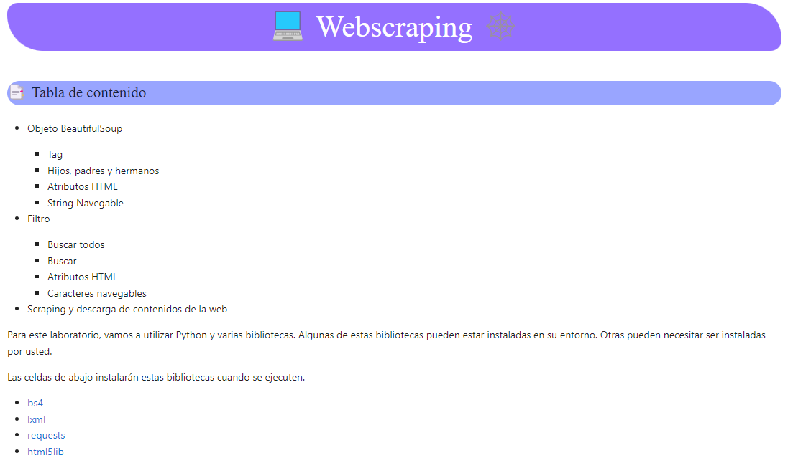
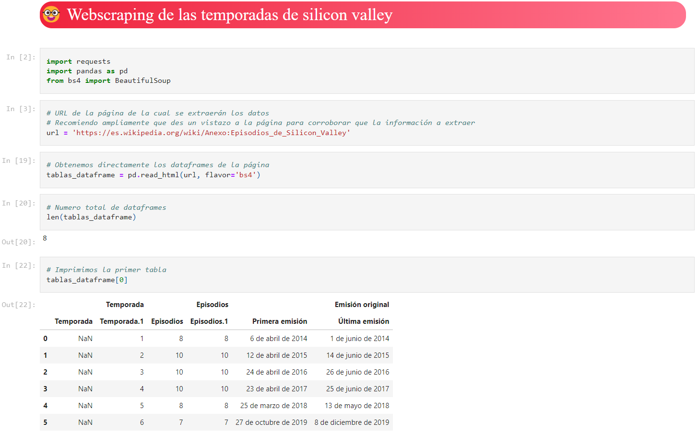

## Basicos del proyecto

### 1. Que es HTML?

El HTML es un lenguaje de marcado para la creación de páginas web.
Contiene etiquetas que definen el contenido de la página web.

> Hola mundo en HTML:

```html
<!DOCTYPE html>
<html lang="en">
<head>
    <meta charset="UTF-8">
    <meta name="viewport" content="width=device-width, initial-scale=1.0">
    <meta http-equiv="X-UA-Compatible" content="ie=edge">
    <title>Document</title>
</head>
<body>
    <h1>Hola mundo</h1>
</body>
</html>
```

### 2. Que es WebScraping?

WebScraping es la técnica de extraer datos de páginas web de forma automática.

> Ejemplo de codigo para extraer datos de una página web:

```python
import requests

url = 'https://www.google.com'

response = requests.get(url)

print(response.text)
```

### 3. Ejemplo de aplicación

Tengo una página web que contiene una tabla de titulos de los capitulos de Silicon Valley.
Para cada temporada, quiero obtener el Titulo, Fecha de emision y el numero de audiencia que alcanzo.
Se puede realizar a mano e implicaria desde minutos hasta horas.

Que pasaria en otro ejemplo donde la informacion se actualiza cada día?
Extraer la informacion puede ser una tarea tediosa, por lo que me webscrapping me ayuda a hacerlo más sencillo.


## Herramientas

BeautifulSoup:

```terminal
pip install beautifulsoup4
```

## Ejemplo

Puedes explorar todo el proceso y codigo en el siguiente Notebook: [WebScraping Lab.ipynb](https://github.com/GilbertoNavaMarcos/WebScraping/blob/main/Webscraping%20Lab.ipynb)



## Practica

Un ejemplo rapido con la informacion de las temporadas de Silicon Valley.

Puedes ver el Notebook: [Silicon_Valley.ipynb](https://github.com/GilbertoNavaMarcos/WebScraping/blob/main/Silicon_Valley.ipynb)


